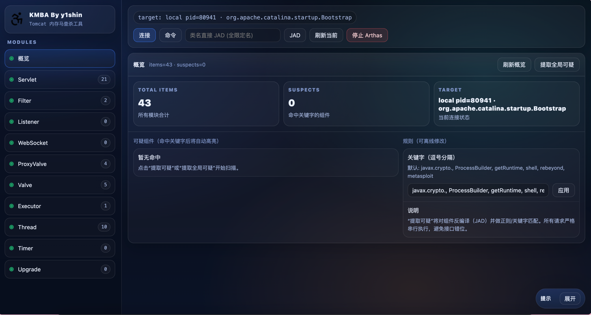

# KMBA — Tomcat 内存马查杀工具

KMBA 是一个基于 Web 的 Java 内存马应急响应工具，用于检测、分析和清除 Apache Tomcat 服务器中的内存 webshell（内存马）。它使用 [Arthas](https://arthas.aliyun.com/) 作为诊断引擎，通过 OGNL 表达式和 `vmtool` 命令直接检查运行中的 JVM 内部状态，无需重启目标应用。


## 功能特性

- **覆盖 10 种内存马类型** — Servlet、Filter、Listener、WebSocket、ProxyValve、Valve、Executor、Thread、Timer、Upgrade
- **按需 JAD 反编译** — 直接从 JVM 中提取任意已加载类的 Java 源码并格式化展示
- **关键字可疑扫描** — 可自定义规则引擎，标记包含恶意特征的类（如 `ProcessBuilder`、`getRuntime`、`javax.crypto.*` 等）
- **多种卸载策略** — 针对不同类型提供温和（cancel/interrupt）和强制两种模式，附带风险说明
- **本地 & 远程连接** — 通过 `jps` + 内置 `arthas-boot.jar` 连接本地 JVM，或通过 WebSocket 连接远程 Arthas 代理
- **单页 Web 管理界面** — 暗色主题，无 CDN 依赖，所有前端资源本地化

## 支持的内存马类型

| 模块       | 目标类 / 范围                                        | 检测方式                  |
|------------|-----------------------------------------------------|--------------------------|
| Servlet    | `StandardContext.servletMappings`                   | vmtool + OGNL 枚举        |
| Filter     | `StandardContext.filterMaps` + `filterConfigs`      | vmtool + OGNL 枚举        |
| Listener   | `StandardContext.applicationEventListenersList`     | vmtool + OGNL 枚举        |
| WebSocket  | `WsServerContainer.configExactMatchMap`             | vmtool + OGNL 枚举        |
| ProxyValve | `StandardPipeline` 的 first/basic 字段 (Java Proxy) | vmtool + 反射遍历          |
| Valve      | `StandardContext.pipeline.valves`                   | vmtool + OGNL 枚举        |
| Executor   | `NioEndpoint.executor`（被替换的执行器实例）           | vmtool + 类名比对          |
| Thread     | 所有 `java.lang.Thread` 实例（按 target 类过滤）      | vmtool + 线程名匹配        |
| Timer      | 所有 `java.util.TimerTask` 实例                     | vmtool + 类名过滤          |
| Upgrade    | `AbstractHttp11Protocol.httpUpgradeProtocols`       | vmtool + OGNL 枚举        |

## 架构

```
浏览器 (SPA)
    │  REST API (JSON)
    ▼
Spring Boot 2.6.13 (KMBA)  ──WebSocket──▶  Arthas Agent (目标 JVM)
    │                                           │
    ├── /arthas/connect        本地 attach       ├── vmtool / ognl
    ├── /arthas/connectRemote  远程 WebSocket    ├── jad / sc
    ├── /{模块}/list           枚举组件           └── dashboard / ...
    ├── /{模块}/unload         卸载组件
    ├── /jad/*                 反编译
    └── /arthas/exec           执行原始 Arthas 命令
```

所有命令执行严格遵循**串行化**，防止 WebSocket 消息交错导致结果混乱。

## 快速开始

### 环境要求

- JDK 8+
- Maven 3.6+
- 目标 JVM 需要能够被 Arthas attach（本地连接时 KMBA 会自动处理）

### 构建与运行

```bash
mvn clean package -DskipTests
java -jar target/KMBA-0.1.jar
```

启动后浏览器访问 `http://localhost:9099`。

### 使用流程

1. 点击 **连接** 打开连接对话框
2. 选择一个本地 JVM 进程（通过 `jps` 自动发现），或输入远程 Arthas WebSocket 地址
3. 在左侧导航栏切换模块，枚举已加载的组件
4. 对任意条目点击 **JAD** 反编译查看源码
5. 对可疑条目点击 **UNLOAD** 进行卸载（部分类型提供温和/强制两种策略选择）
6. 使用 **提取可疑** 批量按关键字规则扫描组件
7. 使用 **命令** 终端执行任意 Arthas 原始命令

## 项目结构

```
src/main/java/com/kmba/
├── KmbaApplication.java          # Spring Boot 启动入口
├── arthas/
│   ├── ArthasController.java     # 连接管理、进程列表、命令执行
│   ├── Servlet.java              # Servlet 型内存马检测/卸载
│   ├── Filter.java               # Filter 型内存马检测/卸载
│   ├── Listener.java             # Listener 型内存马检测/卸载
│   ├── Socket.java               # WebSocket 型内存马检测/卸载
│   ├── ProxyValve.java           # Proxy 型 Valve 检测/卸载
│   ├── Valve.java                # Valve 型内存马检测/卸载
│   ├── Executor.java             # Executor 替换型检测/卸载
│   ├── Thread.java               # 恶意线程检测/卸载
│   ├── Timer.java                # TimerTask 型检测/卸载
│   ├── Upgrade.java              # HTTP Upgrade 型检测/卸载
│   └── JAD.java                  # 类反编译（jad/sc）
├── tunnel/
│   └── ArthasWsWrapper.java      # WebSocket 封装，串行命令执行
├── Utils/
│   ├── ArthasWsClient.java       # Arthas WebSocket 协议客户端
│   ├── ArthasWsRequest.java      # Arthas WS 请求模型
│   ├── ArthasStringUtil.java     # 字符串解析工具
│   ├── Dict.java                 # 常量与配置
│   ├── OGNLUtils.java            # OGNL 严格模式绕过
│   └── TomcatUtil.java           # Tomcat 实例计数工具
└── pojo/
    └── AgentInfo.java            # Agent 连接信息模型

src/main/resources/
├── static/
│   ├── index.html                # 单页管理界面
│   └── js/                       # Prism.js、tailwindcss、lucide 图标
└── application.properties        # 服务配置（端口 9099）
```

## 依赖

- Spring Boot 2.6.13（Web、Thymeleaf）
- [Java-WebSocket](https://github.com/TooTallNate/Java-WebSocket) 1.5.3 — Arthas WebSocket 通信
- [FastJSON](https://github.com/alibaba/fastjson) 1.2.83 — Arthas 返回结果的 JSON 解析
- Log4j 2.23.1 — 日志记录

## 免责声明

本工具仅限**授权的安全运维和应急响应**场景使用。请仅在您拥有或被明确授权分析的系统中使用。作者不承担任何滥用导致的后果。

## 参考文章

- [Arthas — 阿里巴巴 Java 诊断工具](https://arthas.aliyun.com/)
- [Java 内存马系列 — su18.org](https://su18.org/post/memory-shell/)
- [Tomcat Filter 型内存马 — drun1baby](https://drun1baby.top/2022/08/22/Java内存马系列-03-Tomcat-之-Filter-型内存马/)
- [Tomcat Valve 型内存马 — y4er.com](https://y4er.com/posts/tomcat-upgrade-memshell/)
- [Tomcat Listener 型内存马 — chenlvtang](https://chenlvtang.top/2022/08/03/Tomcat之Listener内存马/)
- [Tomcat Upgrade 内存马 — FreeBuf](https://www.freebuf.com/articles/vuls/345119.html)
- [MemShellParty — ReaJason](https://github.com/ReaJason/MemShellParty)

## 协议

本项目仅用于教学与防御性安全研究。
